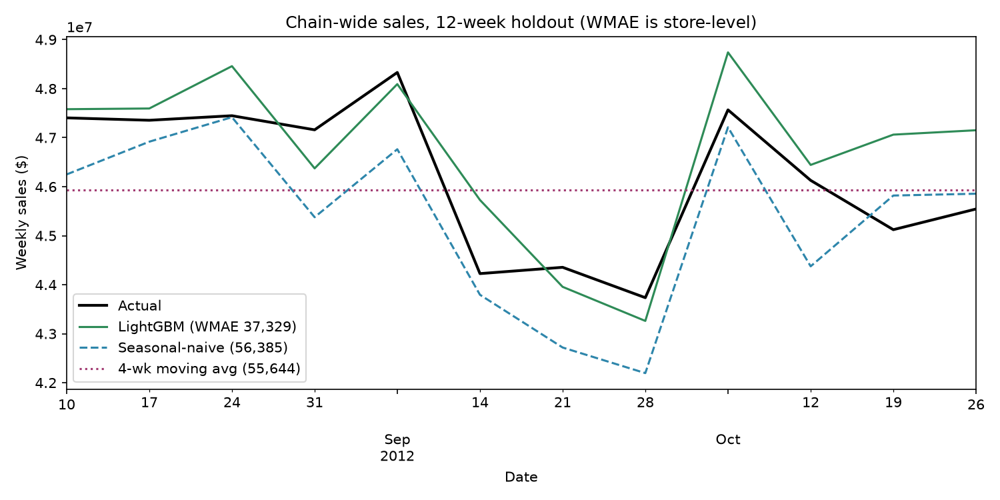

# FMCG Demand Forecasting & Promotion Effectiveness

**Dataset:** [Walmart Recruiting - Store Sales Forecasting](https://www.kaggle.com/c/walmart-recruiting-store-sales-forecasting) — 421,570 weekly store-department sales records, 45 stores, 81 departments, Feb 2010–Oct 2012.

## Key findings

- **Holiday weeks only lift sales +7.1%** on average — smaller than the "holidays drive everything" intuition suggests, and it's not uniform (Thanksgiving/Christmas week spikes hard, other flagged holidays barely move the needle — see `weekly_sales_trend.png`).
- **Markdown intensity correlates with much higher sales** (+76% non-holiday, +91% holiday, comparing high vs low markdown terciles) — **but this is correlation, not proof markdowns cause it.** Walmart's own markdown timing is itself concentrated around naturally high-traffic weeks, so this number overstates true incremental lift. A causal read needs a matched/diff-in-diff design (same store, markdown vs non-markdown weeks in comparable seasons) — flagged as the natural next step, not claimed here.
- **Store Type A stores average $20.1K/week vs Type C's $9.5K/week** — a ~2.1x gap that tracks store size (182K vs 40K sq ft) almost linearly, i.e. Type isn't adding independent lift beyond footprint.
- **Forecasting: a store × department LightGBM model cuts 12-week-ahead error by 32.9% vs the best baseline** (holdout WMAE **37,329** vs 55,644 for a 4-week moving average and 56,385 for seasonal-naive), and it wins all 3 earlier rolling-origin backtest folds too (mean WMAE 49,507 vs 66,035 for the best baseline). All numbers use the competition's own holiday-weighted WMAE metric (holiday weeks ×5).

## Method

1. Merge `train.csv` (weekly sales) + `features.csv` (temperature, fuel price, CPI, unemployment, markdowns) + `stores.csv` (type, size) on Store/Date.
2. Markdown data only exists from **2011-11-11 onward** — comparisons involving markdowns are restricted to that window; comparisons before it would silently treat "no data yet" as "no promotion," which is wrong.
3. Promotion effect: bucketed store-week markdown $ total into Low/Medium/High terciles *within* holiday and non-holiday groups separately, to avoid the holiday effect leaking into the promo comparison.
4. Forecast baseline: 12-week time-based holdout (no shuffling — this is a time series, random splits would leak future into past), evaluated with WMAE weighting holiday weeks 5x (matches the actual Kaggle competition scoring).

## Forecasting model (`forecast.py`)

| Window (12 weeks after cutoff) | LightGBM | Seasonal-naive | 4-wk moving avg |
|---|---:|---:|---:|
| Fold 1 (cutoff 2011-11-25, holiday season) | **60,597** | 76,708 | 161,881 |
| Fold 2 (cutoff 2012-02-17) | **47,255** | 66,379 | 54,370 |
| Fold 3 (cutoff 2012-05-11) | **40,670** | 55,019 | 67,931 |
| **Holdout (cutoff 2012-08-03)** | **37,329** | 56,385 | 55,644 |

Store-level WMAE, lower is better. The holdout and baselines are exactly the ones `analysis.py` reports, so the comparison is like-for-like.



**How it avoids fooling itself**
- **No future leakage by construction:** every lag is ≥ 12 weeks (the forecast horizon), so a prediction for `cutoff + h` only reads sales up to `cutoff`. `test_forecast.py` checks this: features come out identical whether or not the future sales are in the input, and the test fails if a `lag_1` is added.
- **Only features known 12 weeks ahead:** calendar, holiday flag, store/dept attributes and markdowns (planned promotions). Temperature, fuel price, CPI and unemployment are excluded because they are not known at forecast time.
- **The holdout is never used for model choices:** the objective was chosen on the fold-1 validation window (L2 51.0k vs L1 62.4k vs Huber 66.5k store WMAE). The number of trees comes from early stopping on the 12 weeks *before* each cutoff.
- **Trained at dept level, scored at store level:** the model learns department-specific seasonality, and its predictions are summed to store level so they are scored on the same target as the baselines. Holiday weeks get a sample weight of 5, matching the metric.

**Top features by gain:** 12-week rolling mean (lagged 12 weeks), 4-week rolling mean, same week last year (`lag_52`), department, week of year.

**MLOps pieces**
- Every run is tracked in MLflow (params, per-fold and holdout metrics, model, feature importance): `mlflow ui --backend-store-uri sqlite:///mlflow.db`.
- `python forecast.py score` writes the 12-week forecast after the last observed week (2012-11-02 → 2013-01-18, 3,093 active store-dept series) and a PSI drift report comparing the scoring window with the last 52 training weeks.
  - In the latest run, all sales-lag features are stable (PSI ≤ 0.006). MarkDown2 and MarkDown4 are flagged DRIFT (PSI 0.78 / 0.72) because the scoring window is the Nov–Jan clearance season.
  - That flag is expected, but it is also exactly what should trigger a check before trusting holiday-season forecasts.

**Limitations:** hyperparameters are fixed and not tuned, it is a single model with a single seed, and the same minimum lag of 12 is used for every horizon. A 1-week-ahead forecast could use fresher lags, and per-horizon models would likely do better on short horizons.

```bash
pip install -r requirements.txt
python forecast.py train   # backtest + holdout + final model, logged to MLflow
python forecast.py score   # next 12 weeks + drift report
python -m pytest test_forecast.py
```

## Files

- `dashboard.html` — **interactive dashboard, open directly in any browser** (no server needed)
- `outputs/report.pdf` — **3-page PDF report**, stakeholder-ready summary of findings
- `analysis.py` — full pipeline (`python analysis.py`)
- `forecast.py` — LightGBM backtest / training / scoring / drift; `test_forecast.py` — leakage, metric and PSI checks
- `outputs/model_metrics.json`, `outputs/backtest_folds.csv`, `outputs/lgbm_holdout_predictions.csv`, `outputs/feature_importance.csv`, `outputs/forecast_next_12w_by_store.csv`, `outputs/drift_report.csv`
- `outputs/promo_effect_by_holiday.csv`, `outputs/store_type_performance.csv`, `outputs/forecast_holdout.csv`
- `outputs/weekly_sales_trend.png`, `outputs/forecast_comparison.png`
- `outputs/headline_stats.json`

## Recommendation

1. Don't scale markdown spend chain-wide based on the raw +76-91% correlation — run a controlled test (matched stores/weeks) before committing incremental promo budget.
2. Type C stores' sales-per-sqft is actually competitive with A/B once size is accounted for — expansion capital is better spent on more Type A-sized locations than assuming Type A's format itself outperforms.
3. Use the department-level LightGBM forecast for planning instead of the moving-average baseline, since it is about a third more accurate on every backtest window. Before each holiday season, check the drift report so that markdown plans far outside the training history are reviewed rather than trusted blindly.
